# 计算机组成原理

> 基于[B站 王道计算机考研-计算机组成原理](https://www.bilibili.com/video/BV1ps4y1d73V?spm_id_from=333.788.videopod.episodes&vd_source=31d39c465d959f9ebfb4e20fc1ca0a9d)的视频笔记
>
> 该视频生动有趣、脉络清晰。

## 第一章 计算机系统概述

### 计算机发展历程

- 什么是计算机系统
  - 系统软件：用来管理整个计算机系统
  - 应用软件：按任务需求编制成的各个程序
- 硬件的发展
  - 第一代：电子管时代
  - 第二代：晶体管时代
  - 第三代：中小规模集成电路时代
  - 第四代：大规模、超大规模集成电路时代
- 软件的发展
- 目前的发展趋势
  - 更微型、多用途
  - 更巨型、超高速

### 计算机硬件的基本组成

- 五大部分

  - 输入设备：将信息转换为机器能识别的形式
  - 输出设备：将结果转换为人们熟悉的形式
  - 主存储器：存放数据和程序
  - 运算器：算术运算、逻辑运算
  - 控制器：指挥各部件，使程序运行

  > 主存储器、运算器、控制器三者合称**主机**

- 冯诺依曼结构

  - 首次提出“存储程序”的概念
  - 以运算器为中心

- 现代计算机结构：

  - 以存储器为中心
  - CPU = 运算器 + 控制器

### 各硬件部件

- 主存
  - 存储体
    - 存储元
    - 存储单元
    - 存储字
    - 存储字长
    - 地址
  - MAR：地址寄存器，用于指明要读/写哪个存储单元。其位数反映存储单元数量
  - MDR：数据寄存器，用于暂存要读/写的数据。其位数=存储字长
- 运算器
  - ACC：累加计数器，存放操作数、运算的结果
  - MQ：乘商寄存器，进行乘、除法时用得到
  - X：通用寄存器，存放操作数
  - ALU：算数逻辑单元，用电路实现各种算数运算、逻辑运算
- 控制器
  - PC：程序计数器，存放下一条指令的地址
  - IR：指令寄存器，存放当前执行的指令
  - CU：控制单元，分析指令，给出控制信号
- 工作过程
  - 初始：指令、数据存入主存，PC指向第一条指令
  - 从主存中取指令放入IR、PC自动加1、CU分析指令、CU指挥其他部件执行指令

### 冯诺依曼计算机的特点

1. 计算机由五大部件组成
2. 指令和数据以同等地位存于存储器，可按地址寻访
3. 指令和数据用二进制表示
4. 指令由操作码和地址码组成
5. 存储程序
6. 以**运算器**为中心（现在一般以存储器为中心）

### 计算机软件

- 两类软件
  - 系统软件：管理计算机系统的硬件资源，向上层应用程序提供服务
  - 应用软件：按应用场景需要编制成的各种程序，直接为用户提供服务
- 三个级别的语言
  - 高级预压、汇编语言、机器语言
  - 编译程序（编译器）——将高级语言一次全部翻译为汇编语言，或直接翻译为机器语言
  - 解释程序（解释器）——高级语言翻译为机器语言（翻译一句执行一句）
- 软件和硬件的逻辑功能等价性：同一个功能，既可以用硬件实现，也可以用软件实现
- 指令集体系结构（ISA）：ISA定义一台计算机可以支持哪些指令，以及每条指令的作用是什么、每条指令的用法是什么

### 计算机层次结构

- 五层
  - M4：高级语言机器（执行高级语言）
  - M3：汇编语言机器（执行汇编语言）
  - M2：操作系统机器（向上提供广义指令）
  - M1：传统机器（执行机器语言指令）
  - M0：微程序机器（执行微指令）
- 三个级别的语言
  - 高级语言、汇编语言、机器语言
  - 编译程序——将高级语言一次全部翻译为汇编语言，或直接翻译为机器语言
  - 汇编程序——将汇编语言翻译为机器语言
  - 解释程序——高级语言翻译为机器语言（翻译一句执行一句）

### （*）计算机系统的工作原理

> 以C语言查程序为例

源程序——（预处理器）——>

预处理的源程序——（**编译器**）——>【编译器：将源程序翻译为汇编语言】

汇编语言程序——（**汇编器**）——>【汇编器：将汇编语言程序翻译为二进制机器语言】

机器语言程序（目标模块）

​			+											——（**链接器**）——【链接器：将多个相关的目标模块链接成完整的可执行文件】——>可执行文件

其他被引用的目标模块

### 计算机的性能指标

- 存储器的容量
  - MAR的位数反映存储单元数量
  - MDR反映每个存储单元大小
- CPU
  - 时钟周期：CPU中最小的时间单位，每个动作至少要1个时钟周期
  - 主频（始终频率）：`=1/时间周期，单位：Hz`
  - CPI：执行一条指令所需的时钟周期数
  - CPU执行时间
    - 运行一个程序所花费的时间
    - `=(指令条数*CPI)/主频`
  - IPS：`每秒执行多少条指令=主频/平均CPI`
  - FLPOS：每秒执行多少次浮点运算
- 其他：数据通路宽度、吞吐量、响应时间、基准程序
- 常用数量单位
  - 描述存储容量、文件大小时：$K=2^{10},M=2^{20},G=2^{30},T=2^{40}$
  - 描述频率、速率时：$K=10^{3},M=10^{6},G=10^{9},T=10^{12}$

## 第二章 数据的表示和运算

### 进位计数制

- r进制数：基数 = r，每个数码位可能出现r种字符。逢r进1
- r进制数-->十进制
  - $K_nK_{n-1}\dots K_2K_1K_0K_{-1}K_{-2}\dots K_{-m} = K_n \times r^n + K_{n-1} \times r^{n-1} + \dots K_2 \times r^2 + K_1 \times r^1 + K_0 \times r^{0} + K_{-1} \times r^{-1} + K_{-2} \times r^{-2} + \dots + K_{-m} \times r^{-m} $
  - r进制数的数值 = 各数码位与位权的乘积之和
- 二进制<-->八进制：每3个二进制位对应一个八进制位
- 二进制<-->十六进制：每4个二进制位对应一个十六进制位

> ps：注意“补位”

- 十进制<-->r进制

  - 整数部分：除基取余法，先取的的“余”是整数的低位
  - 小数部分：乘积取整法，先取得的“整”是小数的高位

  > 有的十进制小数可能无法用二进制精确表述（如0.3）

- 真值和机器数

  - 真值：实际的带正负号的数值（人类习惯的样子）
  - 机器数：把正负号数字化的数（存到机器里的样子）

### 定点数的编码表示

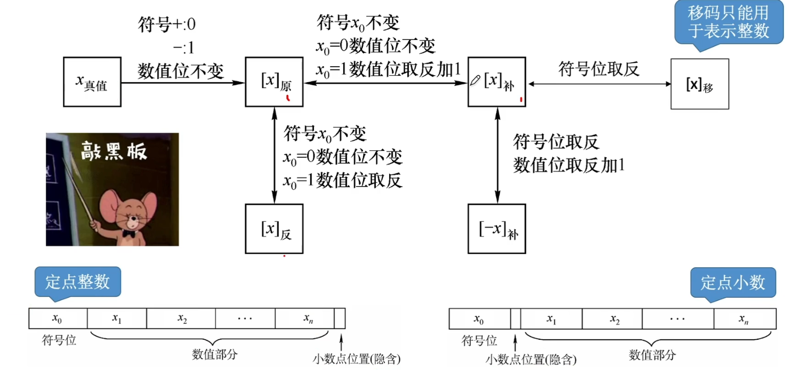

----

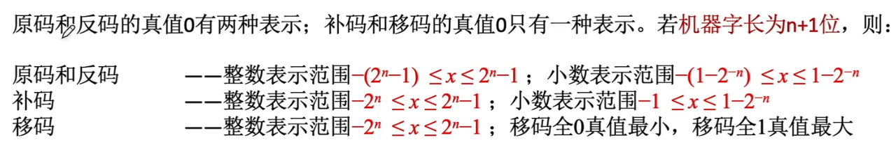

### 各种码的作用

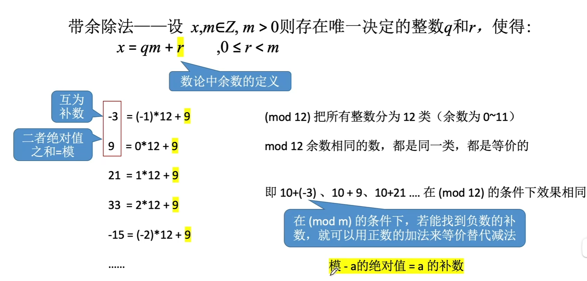

---

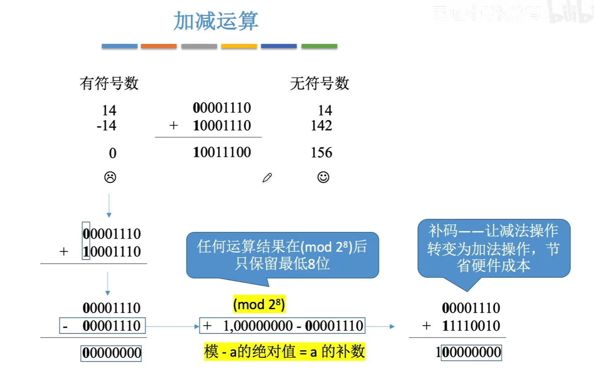

---

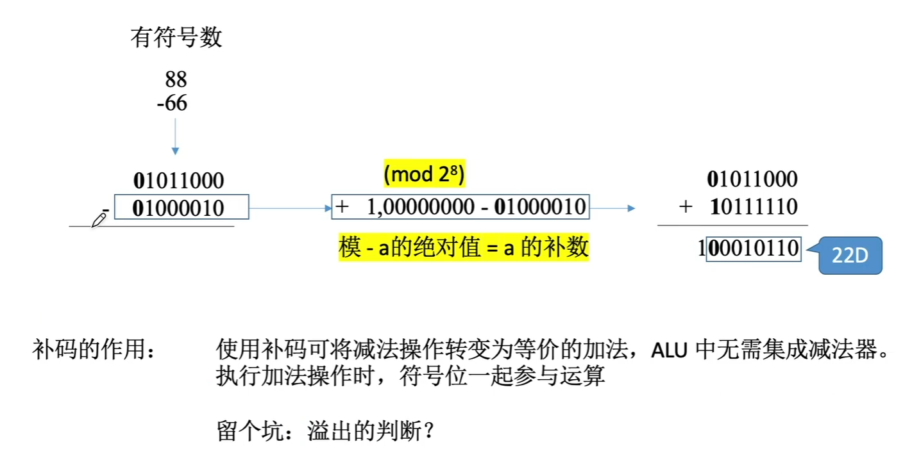

---

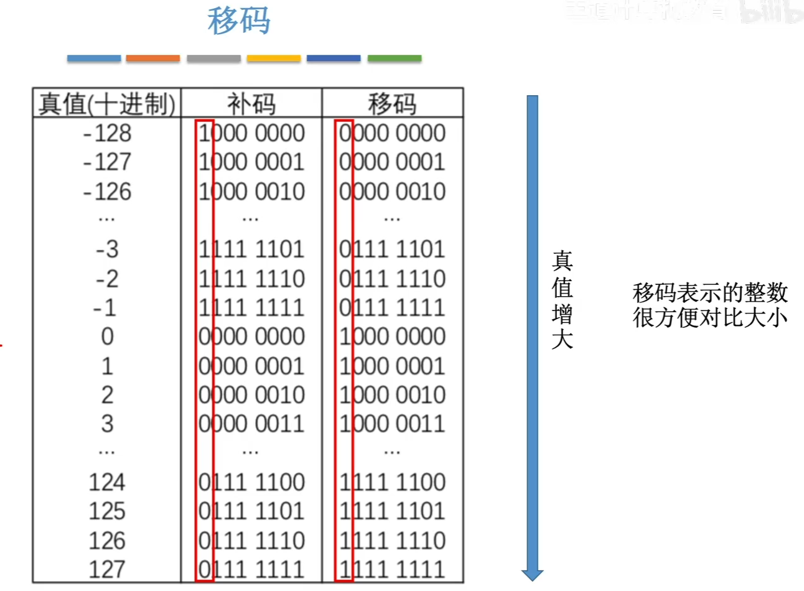

### C语言中的整数类型及类型转换

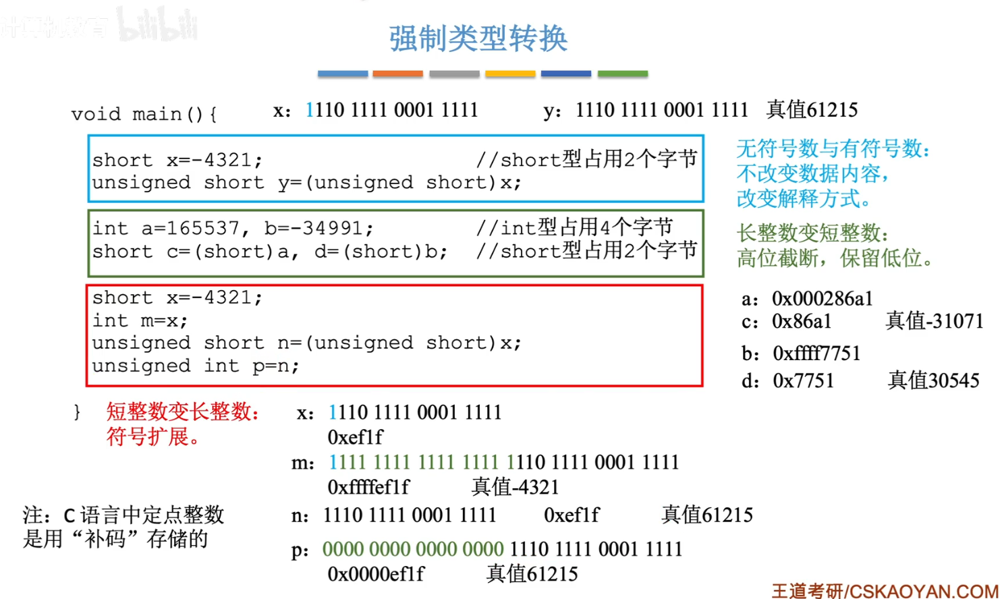

### 零拓展、符号拓展

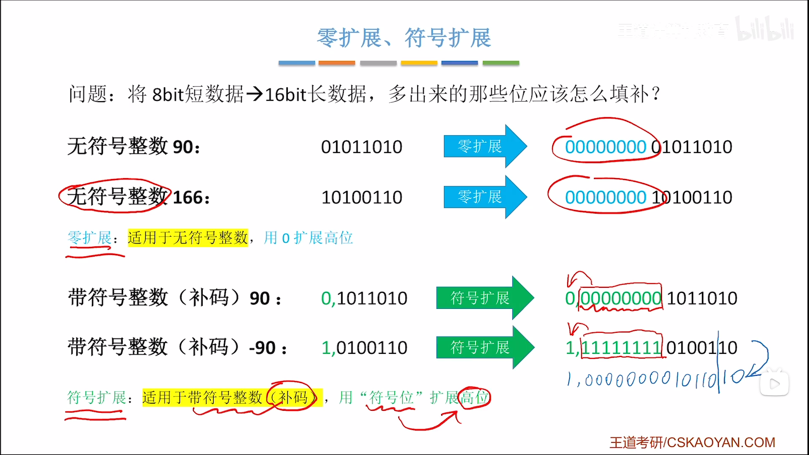

### 数字电路知识回顾

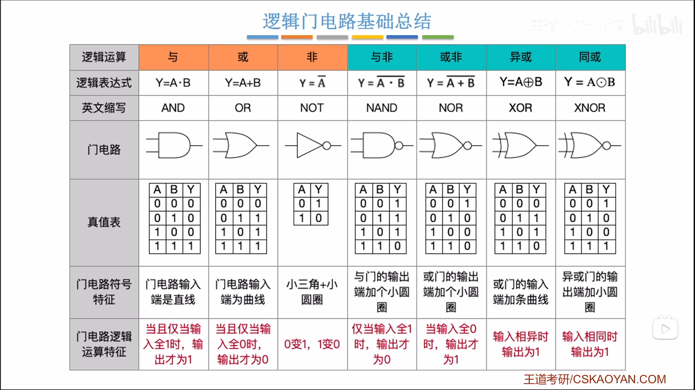

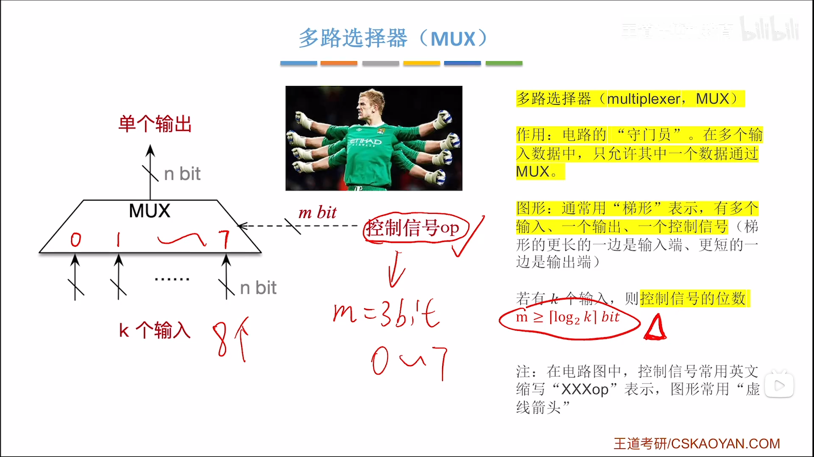

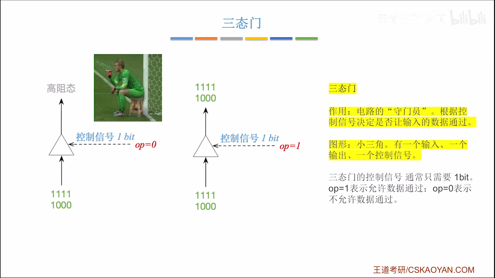

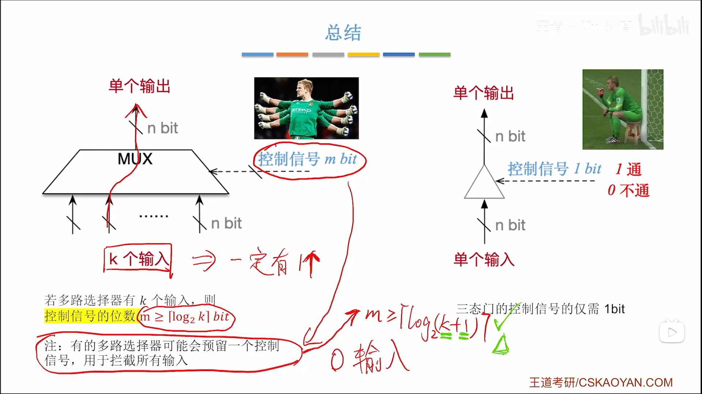

### 加法器

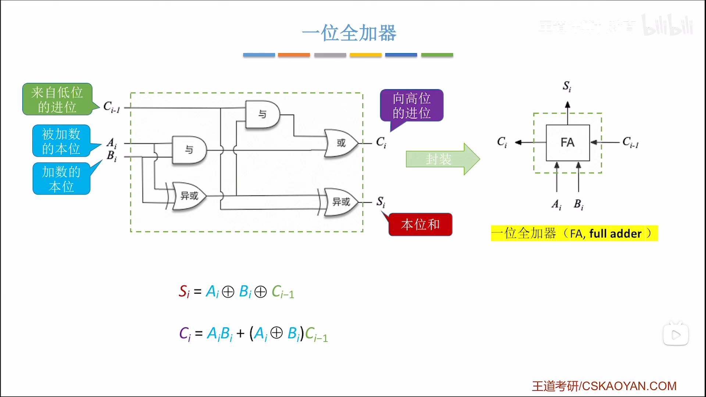

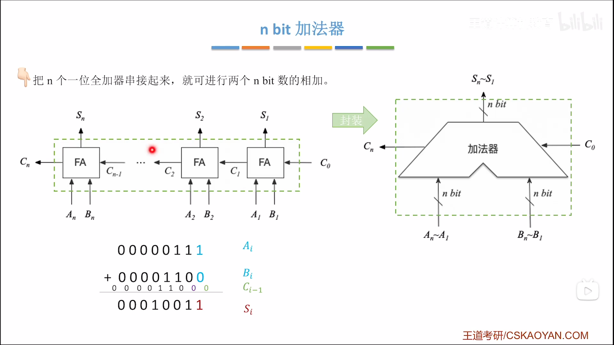

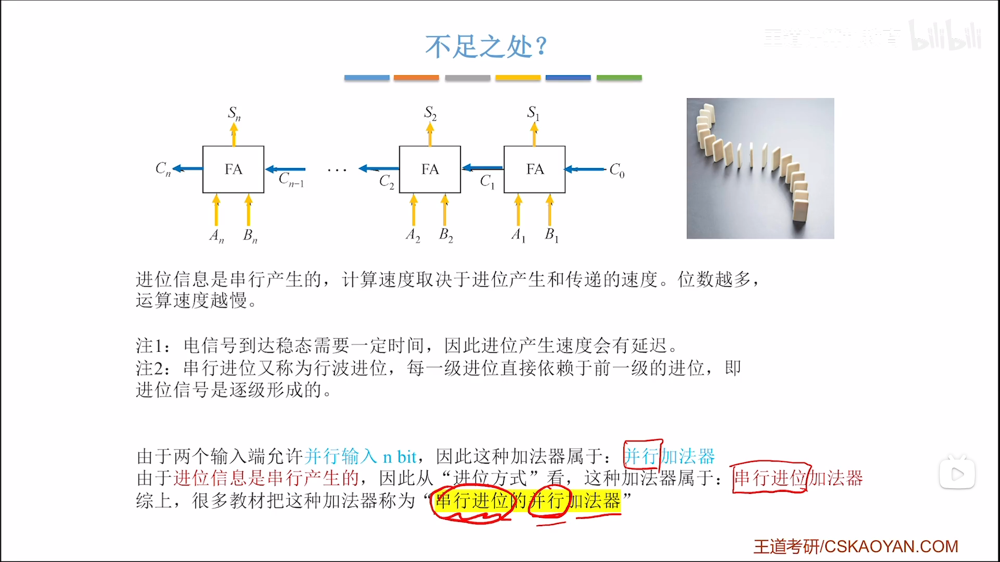

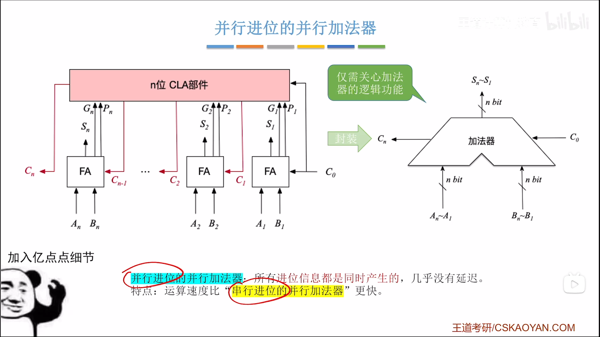

