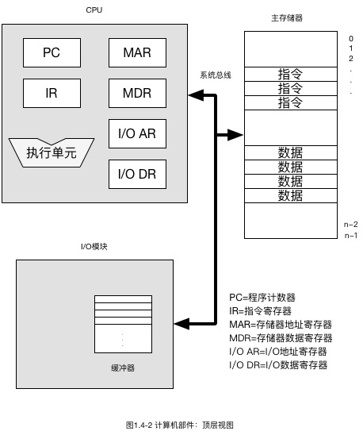

# 计算机体系结构和计算机组成  

### 两个概念的区别

计算机体系结构是那些对成员可见的系统属性。换句话说， 这些属性直接影响到程序的逻辑执行。

计算机组成是指如何实现计算机体系结构所体现的属性，是实现结构规范的操作单元及其相互连接。

计算机体系结构的属性包括指令集、用来表示各种数据类型的比特数、输入输出机制以及内存寻址技术。

计算机组成的属性包括那些对程序员可见的硬件细节，如控制信号、计算机和塞舌的接口以及存储器使用的技术。

### 结构和功能

计算机是一个复杂的系统，包含数百万个电子元件，复杂系统的关键是分层性质。层次系统是一系列相互关联的子系统，每个子系统又在结构上分层，直到分成我们所能达到的一些基本子系统的最低级。

结构： 部件相互关联的方法

功能：作为结构组成部分的各个独立部件的操作。

### 基本功能

计算机的基本功能有：数据处理、数据存储、数据传输和控制。

图1.1-1 计算机的功能

图1.1-2 计算机的功能流程

### 结构组件

计算机中有四种主要的结构组件：

1. 中央处理器（Center Processor Unit, CPU): 它控制计算机的操作并且执行数据处理功能，简称处理器。

2. 主存储器 （Main Memory)：存储程序和数据

3. 输入输出 （Input / Output, I/O)： 在计算机和外部设备之间传输数据

4. 系统互连：为CPU、主存储器和I/O之间提供通信机制，也就是总线系统。

   

   

图1.1-3 计算机：顶层结构

### 总线结构（小、微型机的典型结构）

所谓总线(Bus)是一组能为多个部件服务的公共信息传送线路，它能分时地发送与接收各部件的信息。

系统总线按传送信息的不同可以分为：地址总线、数据总线和控制总线。地址总线（Address Bus）由单方向的多根信号线组成，用于CPU向主存、外设传输地址信息；数据总线（Data Bus）由双向的多根信号线组成，CPU可以沿这些线从主存或外设读入数据，也可以沿这些线向主存或外设送出数据；控制总线（Control Bus）上传输的是控制信息，包括CPU送出的控制命令和主存（或外设）返回CPU的反馈信号。

图1.1-4 小、微型计算机的典型结构

### 大、中型计算机的典型结构

大、中型计算机系统的设计目标更着重于系统功能的扩大与效率的提高。在系统连接上分为四级：主机、通道、设备控制器和外部设备。

图1.1-5 大、中型计算机的典型结构

# 计算机的硬件组成

### 存储程序控制概念：

存储程序控制概念是冯·诺依曼于1945年6月首先提出来的。它可以概括为以下几点：

1. 计算机（硬件）是由运算器、存储器、控制器、输入设备和输出设备5个基本部件组成。
2. 计算机内部采用二进制来表示指令和数据。
3. 将编号的程序和原始数据事先存入存储器中。
4. 把编好的程序和原始数据预先存入计算机的主存储器中，使计算机在工作时能够连续、自动、高速地从存储器中取出一条条指令并加以执行， 从而自动完成预定的任务。 

### **计算机的硬件组成**

原始的冯·诺依曼计算机在结构上是以运算器为中心的，而发展到现在，已转向以存储器为中心。

通常将运算器和控制器合称为中央处理器（Central Processing Unit, CPU)。

中央处理器和主存储器（内存储器）一起组成主机部分。

除去主机以外的硬件装置，如输入设备、输出设备和辅助存储器等，称为外围设备或外部设备。

CPU 负责与存储器间交换数据，为了这个目的，CPU 一般使用两个内部寄存器，一个是存储器地址寄存器MAR，为下一次读写指定存储器的地址；另一个是存储器数据寄存器MDR, 存放数据到内存或从内存接收的数据。类似的， I/O地址寄存器I/O AR指定一个特定的I/O设备；I/O 数据寄存器 I/O DR用于I/O模块与CPU之间数据交换。

### **运算器**

运算器部件是计算机中进行数据加工的部件，其主要功能包括：

1. 执行数值数据的算术加减乘除等运算，执行逻辑数据的与或非等逻辑运算，由一个被称为 ALU （Arithmetic and Logical  Unit, ALU)的部件完成。
2. 暂时存放参加运算的数据和中间结果，由多个通用寄存器来承担
3. 运算器通常也是数据传输的通路

### **控制器**

控制器是计算机中控制执行指令的部件，主要功能是按照人们预先确定的操作步骤，控制整个计算机的各部件有条不紊地自动工作。

1. 正确执行每条指令

  （1）首先是取来一条指令，

  （2）接着分析这条指令， 

  （3）再按指令格式和功能执行这条指令

2. 保证指令按规定序列自动连续地执行。
3. 对各种异常情况和请求及时响应和处理。

### **存储器**

存储器用来存放程序和数据，是计算机能够实现存储程序控制的基础。

由高速缓冲存储器，主存储器，外存储器所组成的多级（层）存储器系统，是计算机中用于存储程序和数据的子系统。这三级存储器所用的存储介质、工作原理和特性各不相同。

### **输入设备** 

输入设备是向计算机中送入程序和数据的有一定独立功能的设备，通过接口和总线与计算机主机连通，用于人—机交互联系,如计算机键盘和鼠标等。

### **输出设备**

输出设备的任务是将计算机的处理结果以数字、字符（汉字）、图形、图像、声音等形式送出计算机。

常用的输出设备有打印机、显示器、辅助存储器等。

### **总线**

总线是一组能为多个部件服务的公共信息传送线路，他能分时地发送与接收各部件的信息。

1. 数据线

数据线提供系统模块间传送数据的途径。这些线组合在一起成为数据总线。典型的数据总线包含32、64、128或更多的分离导线，这些线的数据称为数据总线的宽度。数据总线的宽度是决定系统总体性能的关键。

2. 地址线

用于指定数据总线上数据的来源或去向。地址总线的宽度决定了系统能够使用的最大的存储器容量。地址线通常也用于I/O端口的寻址。地址线的高位用于选择总线上指定的模块，低位用于选择模块内具体的存储单元或I/O端口。

3. 控制线

用来控制对数据线和地址线的存取和使用。控制信号在系统部件之间发送命令和时序信号。时序信号指定了数据和地址信号的有效性，命令信号指定了要执行的操作。

